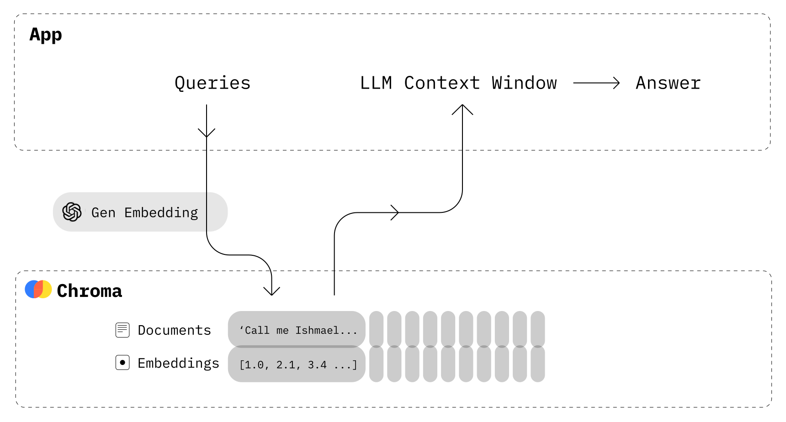
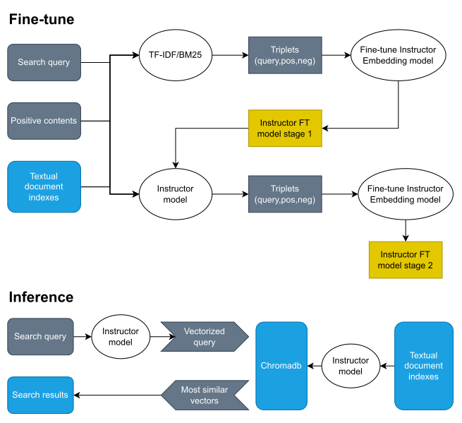

# Deep Learning in Legal System: Opportunities and Challenges

> My bachelor thesis on applying deep learning, information retrieval, and large language models to Vietnamese legal documents.  
> Final thesis score: **9.7/10**.

This repository contains the source code, thesis document, images, data files, and presentation for my bachelor thesis.

**Author:** Ngô Phú Thịnh  
**Major:** Data Science  
**University:** University of Science, Vietnam National University Ho Chi Minh City  
**Supervisor:** Assoc. Prof. Dr. Nguyễn Thanh Bình  
**Year:** 2023

## About

I built this project because I wanted to explore how AI could make legal information easier to search and understand.

Legal documents in Vietnam are often hard for normal users to read, search, and connect with real questions. My thesis studies how deep learning, retrieval models, and large language models can support legal information retrieval, especially for Vietnamese legal text.

The thesis has two main parts:

1. Research on the opportunities and challenges of applying deep learning to legal systems.
2. Practical experiments for Vietnamese legal document retrieval and legal question answering.

## Visual Overview

### Semantic Search


### Chroma Vector Database



### Legal Document Database Structure


### Question Distribution by Legal Field


### Retrieval Pipeline



## What I Built

### Vietnamese Legal Document Dataset

I collected and processed Vietnamese legal normative documents, mainly related to social insurance.

### Legal Document Database

I designed a database structure to store:

- legal documents
- document metadata
- table of contents
- relationships between legal documents
- processed legal text

### Vietnamese Legal Question-Answering Dataset

I prepared legal Q&A data for retrieval experiments and fine-tuning.

### Retrieval Experiments

I tested several information retrieval methods:

- TF-IDF
- BM25
- dense embedding retrieval
- Instructor Embedding models
- fine-tuned Instructor Embedding model
- ChromaDB vector search

## Key Result

Fine-tuning significantly improved retrieval performance on Vietnamese legal text.

| Model | Top 5 Accuracy | Top 10 Accuracy | Top 20 Accuracy | Top 50 Accuracy |
|---|---:|---:|---:|---:|
| INSTRUCTOR-BASE | 0.0119 | 0.0221 | 0.0416 | 0.0944 |
| INSTRUCTOR-LARGE | 0.0138 | 0.0247 | 0.0421 | 0.1023 |
| INSTRUCTOR-XL | 0.0188 | 0.0312 | 0.0537 | 0.1427 |
| INSTRUCTOR-BASE FTS1 | 0.4832 | 0.5741 | 0.6621 | 0.7765 |
| INSTRUCTOR-BASE FTS2 | 0.6431 | 0.7432 | 0.8123 | 0.8912 |

This showed that domain-specific fine-tuning can greatly improve retrieval quality, even with limited hardware and a smaller model.

## Main Topics

- Legal AI
- Vietnamese NLP
- Large Language Models
- GPT and ChatGPT
- Embeddings
- TF-IDF
- BM25
- Sentence Transformers
- ChromaDB
- LangChain
- Open-Domain Question Answering
- Multimodal AI
- Vietnamese legal document retrieval
- Privacy, cost, hallucination, ethics, and reliability in legal AI

## Repository Structure

```txt
.
├── code/
│   ├── law_query/
│   ├── law_query_private/
│   ├── paper/
│   ├── 0.eda.ipynb
│   ├── 1.process.ipynb
│   ├── 2.answers_process.ipynb
│   ├── 3.chromadb.ipynb
│   ├── 4.finetune_model.ipynb
│   └── 5.inference.py
├── document/
│   ├── content/
│   ├── data/
│   ├── images/
│   ├── main.typ
│   ├── ref.bib
│   └── thesis.pdf
├── LuanVan.pptx
└── readme.md
```

## Technologies

- Python
- Jupyter Notebook
- TF-IDF
- BM25
- Sentence Transformers
- Instructor Embedding
- ChromaDB
- LangChain
- Pandas
- NumPy
- Streamlit
- Typst

## Files

- Thesis PDF: [`document/thesis.pdf`](document/thesis.pdf)
- Thesis presentation: [`LuanVan.pptx`](LuanVan.pptx)
- Main Typst source: [`document/main.typ`](document/main.typ)
- Code and experiments: [`code/`](code/)

## Keywords

Vietnamese legal AI, Vietnamese legal question answering, Vietnamese law retrieval, legal information retrieval, Vietnamese NLP, AI for law, legal document search, BM25, TF-IDF, ChromaDB, Instructor Embedding, Sentence Transformers, legal RAG, deep learning legal system, AI in legal system.

## Author

**Ngô Phú Thịnh**

- GitHub: [Th1nhNg0](https://github.com/Th1nhNg0)
- Website: [thinhcorner.com](https://thinhcorner.com)

## Notes

This was an academic thesis project built with limited time, hardware, and data. It can be improved further with larger datasets, stronger embedding models, better Vietnamese legal corpora, and more advanced retrieval methods such as Dense Passage Retrieval or modern RAG pipelines.
